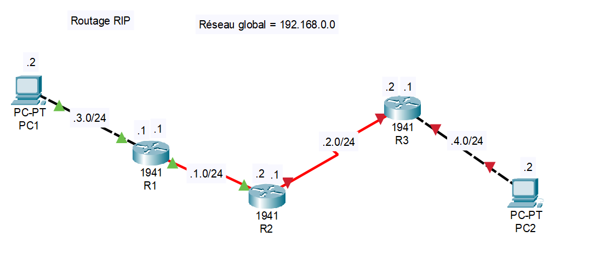

# Routage RIP
## Images
Exemple de disposition de routeurs pour utiliser du RIP

## Définition du routage RIP
Le routage RIP est un protocole permettant aux routeurs de connaitres les addresses IP entre eux afin.

## Exemple sur Image
<b>PC1 veut joindre PC2.</b><br>
Les routeurs n'ont pas l'adresse réseau du prochain hop (routeur).<br>

## En code ça donne quoi ?
```
R1 (config)         > router rip
R1 (config-router)  > version 2
R1 (config-router)  > network 192.168.1.0
R1 (config-router)  > network 192.168.3.0
R1 (config-router)  > exit
```
Faire ceci pour tout les routeurs !<br>
Ne pas oublier de donner des IP aux interfaces, et le no shutdown !