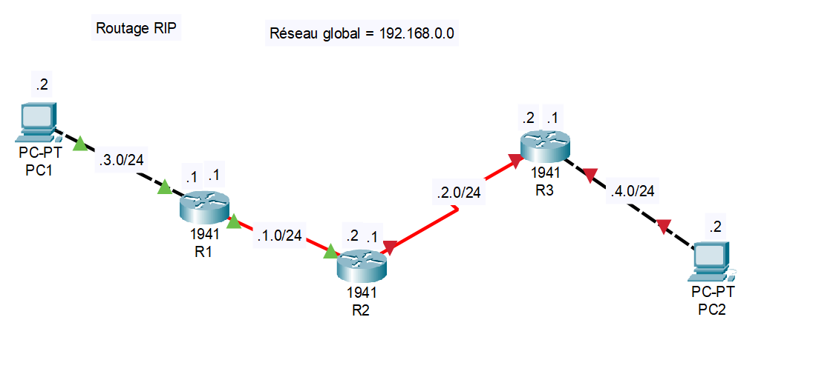

# VLAN
Un VLAN permet de créer un réseau LAN virtuel. Il s'agit de séparer la structure physique de la stack logicielle
(stack 2 OSI: Liaison de données).

## Interet:
- Créer autant de réseaux que voulus
- Gérer les accès a X VLAN en fonction de X entité (service entreprise p.e.)

## Images
Exemple de disposition de routeurs pour utiliser du RIP

## Exemple sur Image
<b>PC1 veut joindre PC2.</b><br>
Les routeurs n'ont pas l'adresse réseau du prochain hop (routeur).<br>

## En code ça donne quoi ?
```
R1 (config)         > router rip
R1 (config-router)  > version 2
R1 (config-router)  > network 192.168.1.0
R1 (config-router)  > network 192.168.3.0
R1 (config-router)  > exit
```
>  **⚠️ Si le ping ne traverse pas les routeurs**: Vérifier que les PC sont connectés à leur GATEWAY !