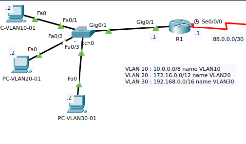

# InterVLAN
Un interVLAN (qui veut dire, rediriger du trafic VLAN sous forme de routage), permet de redistribuer des paquets destinés
à un VLAN lorsque l'on a pas de Switch Layer 3.
## Interet:
- On veut diviser un 0 en plusieurs VLAN mais on a pas de Switch Layer 3

## Images
<br>Exemple de disposition de cas interVLAN où l'on a pas de SWL3 (Switch Layer 3)


## En code ça donne quoi ?
```
R1 (config)            > int G0/1
R1 (config-if)         > no ip addr
R1 (config-if)         > no shutdown
R1 (config-if)         > int G0/1.10
R1 (config-subif)      > encapsulation dot1Q 10
R1 (config-subif)      > ip addr 10.0.0.1 255.0.0.0
```
>  **⚠️ Refaire les G0/1.x autant de fois que l'on a des VLAN à déclarer !**

## Communiquer avec le réseau quand deux VLAN devices sont séparés par un switch physiquement
Il faut savoir qu'un switch par défaut ne laissera pas passer un paquet tagué parce que il ne sait pas
ce a quoi coorespond le paquet.
Pour résoudre cela, on va faire passer le switch en mode trunks et en mode access:
```
SW1 (config)            > int F0/1
SW1 (config-if)         > switchport mode access
SW1 (config-if)         > switchport access vlan 10
SW1 (config-if)         > switchport port mode trunk
```
## **⚠️ Pour les VLAN natifs:**
  ## Conditions
  - [ ] Peu importe si l'on a des des switch layer 3 ou pas
  - [ ] On l'utilise si on fait par exemple de l'IOT (domotique) et que les appareils sont:
    - [X] Incapable de lire les flags VLAN dans les trames ethernet
<br>
<br>

```
R1 (config)            > int G0/1
R1 (config-if)         > no ip addr
R1 (config-if)         > no shutdown
R1 (config-if)         > int G0/1.10
R1 (config-subif)      > encapsulation dot1Q 10 native
```